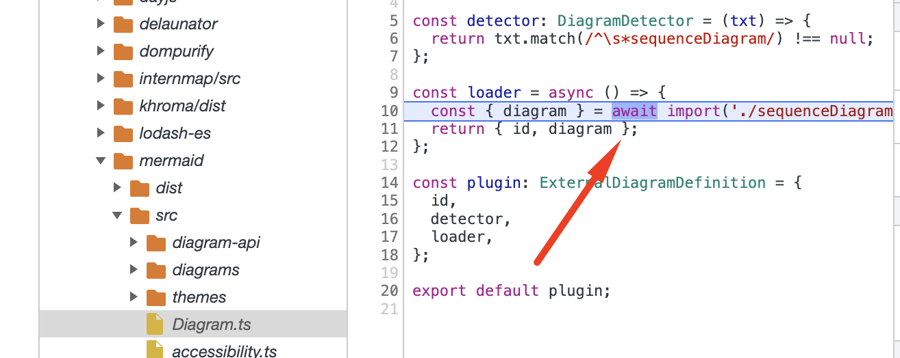

# parcel-mermaid-import-issue

Minimal code sample that reproduces an import issue between parcel/mermaid:

https://github.com/parcel-bundler/parcel/issues/8935

This repo has three branches to demonstrate the behaviour:

Note:

- `main` demonstrates the bug as raised at 
- [`feat/simple-website-demo`](https://github.com/dwmkerr/parcel-mermaid-import-issue/tree/feat/simple-website-demo) branch shows that the bug does not seem to occur for a simple website, whether `--no-optimize` is used or not
- [`feat/webpack`](https://github.com/dwmkerr/parcel-mermaid-import-issue/tree/feat/webpack) - seems to reproduce the issue in webpack
- [`feat/rollup.js`](https://github.com/dwmkerr/parcel-mermaid-import-issue/tree/feat/rollup.js) - demonstrates that using rollup.js as a bundler resolves the issue

## Issue Reproduction Steps

Install all dependencies:

```bash
npm install
```

In the first terminal, start the sample page:

```bash
npm run start-sample-page
```

In the second terminal, bundle the web extension:

```bash
npm start
```

- Open [`chrome://extensions`](chrome://extensions)
- Choose 'Load Unpacked'
- Load the extension from the [`./dist`](./dist) folder
- Browse to [`http://localhost:1234`](http://localhost:1234) to open the sample page
- Open the Chrome Developer Tools (Option + ⌘ + J)

You should see the error:

```
diagramAPI.ts:72 Uncaught (in promise) Error: Diagram error not found.
    at getDiagram (diagramAPI.ts:72:9)
    at new Diagram (Diagram.ts:25:21)
    at Object.render (mermaidAPI.ts:469:12)
```

To see the root cause, open the "Sources" tab in Chrome Developer Tools, then Press `⌘ + O` to search for files. Search for "Diagram.ts", and put a breakpoint on this line:

https://github.com/mermaid-js/mermaid/blob/develop/packages/mermaid/src/Diagram.ts#L101

Press "Render" again - if you step into the `await` call you will see that the following `await import` fails, with an invalid module name:


`
